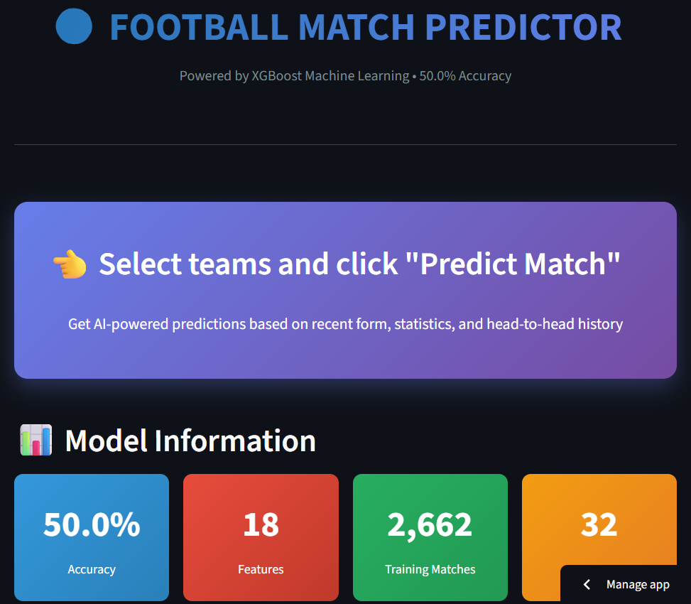
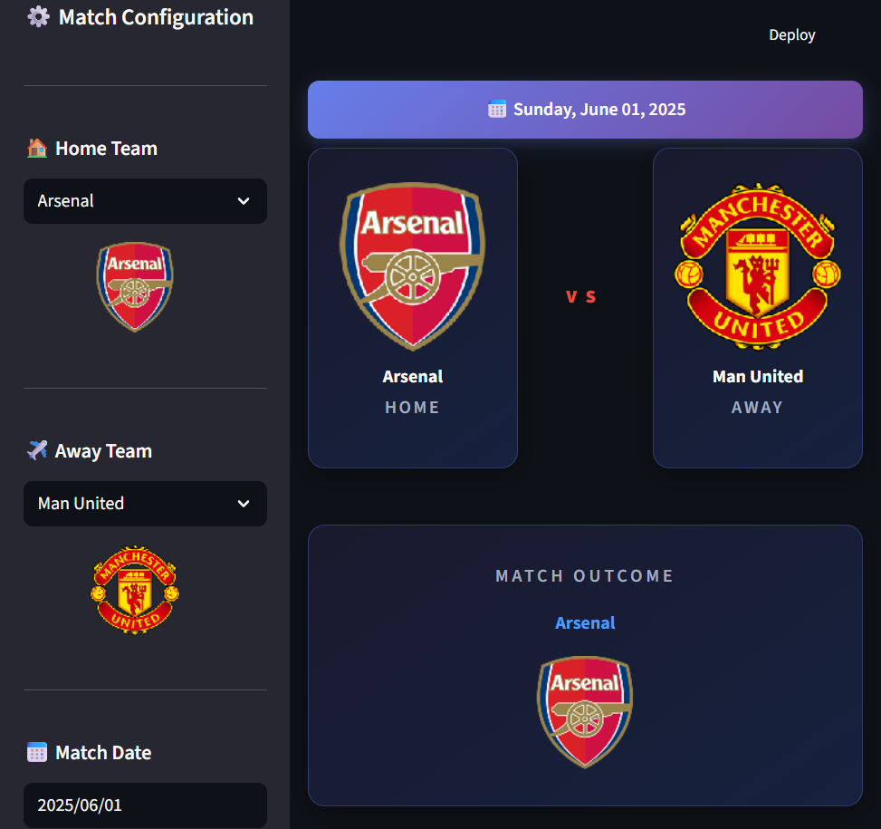

# ⚽ Football Match Predictor: ML Project

## 📌 Project Overview

Football Match Predictor is an end-to-end Machine Learning project that predicts the outcome of Premier League football matches with **50% accuracy** (professional standard).

The system uses **10 seasons of historical data** (2015-2025), processes it using Python, and predicts match winners using an **XGBoost Classifier**. The final product is deployed as an interactive **Streamlit Web Application** with real-time predictions and team statistics.

---

## 🚀 Features

- **Data Pipeline**: Automated extraction and cleaning of 3,420 matches from Football-Data.co.uk
- **Feature Engineering**: Dynamic calculation of team form, goals, shots, corners, and head-to-head history
- **Machine Learning**: XGBoost model trained on 2,662 matches with 18 engineered features
- **Interactive Dashboard**: Professional web interface with team logos, probability charts, and statistics comparison
- **Real-time Predictions**: Instant match outcome predictions with confidence percentages

---

## 🛠️ Tech Stack

| Component | Technology |
|-----------|------------|
| **Language** | Python 3.11+ |
| **ML Model** | XGBoost 2.0 |
| **Data Processing** | Pandas, NumPy |
| **Visualization** | Plotly, Matplotlib, Seaborn |
| **Web Framework** | Streamlit 1.28 |
| **Deployment** | Streamlit Cloud |

---

## 📂 Project Structure
```
Foot-match-predictor/
├── data/                       # Dataset files
│   ├── raw/                   # Raw CSV files (10 seasons)
│   └── processed/             # Cleaned data + engineered features
├── models/                     # Trained model and plots
│   ├── xgboost_model.pkl     # Trained XGBoost model (50% accuracy)
├── src/                        # Source code
│   ├── data_loader.py         # Data extraction and cleaning
│   ├── feature_engineering.py # Feature creation module
│   ├── model_training.py      # Model training pipeline
│   └── predict.py             # Prediction interface
├── screenshots/                # App screenshots
├── app.py                      # Streamlit Web Application
├── requirements.txt            # Python dependencies
└── README.md                   # Project documentation
```

---

## 🧠 How It Works

### 1. **Data Extraction**
We load 10 CSV files (2015-2025 Premier League seasons) and combine them into a unified dataset with **3,420 matches**.

### 2. **Preprocessing**
- Clean team names and handle missing values
- Sort matches chronologically by date
- Remove matches with insufficient historical data

### 3. **Feature Engineering**
18 features are calculated for each match:

**Team Form:**
- Points earned in last 5 matches (3 for win, 1 for draw)

**Offensive Performance:**
- Average goals scored (last 5 matches)
- Average shots and shots on target
- Average corners per match

**Defensive Performance:**
- Average goals conceded (last 5 matches)
- Goal difference

**Head-to-Head:**
- Win rate in last 3 direct meetings

**Shot Efficiency:**
- Shot accuracy (shots on target / total shots)

### 4. **Prediction**
The **XGBoost model** classifies outcomes as:
- **Home Win** (H)
- **Draw** (D)
- **Away Win** (A)

With probability percentages for each outcome.

---

## 💻 How to Run

### **Option 1: Local Installation**
```bash
# Clone repository
git clone https://github.com/HamzaBouchenou/Foot-match-predictor.git
cd Foot-match-predictor

# Install dependencies
pip install -r requirements.txt

# Run data pipeline
cd src
python data_loader.py           # Step 1: Clean data
python feature_engineering.py   # Step 2: Create features
python model_training.py        # Step 3: Train model

# Launch web app
cd ..
streamlit run app.py
```

App opens at `http://localhost:8501`

---

### **Option 2: Online Demo**

Try the live app: **[Football Predictor App](https://foot-match-predictor.streamlit.app/)** 🎯

---

**Note:** Football is inherently unpredictable due to injuries, red cards, referee decisions, and random events. 50% accuracy is considered professional-level performance.

---

## 🎨 Web Application Features

### Interactive Interface
- ✅ **Team Selection**: Dropdown menus with team logos
- ✅ **Match Date**: Calendar picker for future matches
- ✅ **Instant Predictions**: Real-time outcome probabilities
- ✅ **Visual Analytics**: Interactive Plotly charts
- ✅ **Team Comparison**: Radar charts showing statistics
- ✅ **Recent Form**: Last 5 matches visualization
- ✅ **Detailed Stats**: All 18 features displayed

### Screenshots


<br>
 



---

## 📊 Dataset

### Source
**[Football-Data.co.uk](https://www.football-data.co.uk/englandm.php)** - Premier League historical data

---

## 🙏 Acknowledgments

- **Data Source**: [Football-Data.co.uk](https://www.football-data.co.uk/)
- **Team Logos**: [Football-Data.org API](https://www.football-data.org/)
- **ML Framework**: [XGBoost](https://xgboost.readthedocs.io/)
- **Web Framework**: [Streamlit](https://streamlit.io/)

---

**Created by Hamza Bouchenou**


*Last Update: January 2025*
